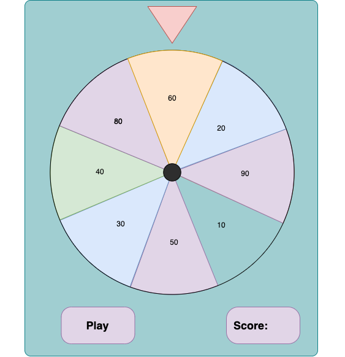

# Wheel of Fortune Version 1.0

Please take a look to the following picture and by using wheel.png file from img directory, try to create this game.
This game works as following:

- When somebody click on the wheel it should start rotating and stop in one random section.
- User can try it three times and after third try program should calculate the final score and display it in score area.
- When wheel stops in area with highest score, the program should display a greeting message as an alert.

### How to make the Game:

step 1: Create the graphical interface with html and css  
step 2: Add animation to rotate the wheel  
step 3: Calculate the rotation degree for each slot and store them in an array  
step 4: Generate a random number that specify the slot number and rotate the wheel properly  
step 5: when wheel stops from rotating, add the result to the score.

### Hints:

Function ==> `function functionName (){ // write the code here }`  
Set contents of HTML tags ==> `document.getElementById('elementId').innerHtml = "some text content";`  
Set styles of HTML tags ==> `document.getElementById('elementId').style`  
set value of html element ==> `document.getElementById('elementId').value`
